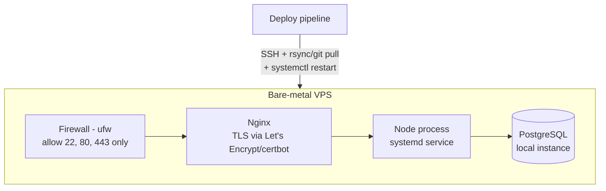

# Purrification — Architecture Plan

Derived from `docs/requirements.md`. This describes *how* the system will be
built to satisfy those requirements — components, data flow, and deployment
topology. Requirement IDs (e.g. `R-AUTH-1`) are referenced throughout for
traceability.

## System overview

```mermaid
flowchart LR
    Browser -->|HTTPS| Nginx[Nginx reverse proxy + TLS]
    Nginx --> App[Next.js app\n(App Router, Node process)]
    App --> DB[(PostgreSQL)]
    App --> Session[Session store\n(DB-backed or signed cookie)]
```

A single Next.js application serves the landing page, the authenticated app
(cat management, quiz, results), and its own API routes — one deployable unit,
one codebase, matching the brief's "single codebase for learning" goal.

## Application layers

| Layer | Responsibility | Satisfies |
|---|---|---|
| **Pages/UI** (`app/`) | Landing page, auth forms, cat dashboard, quiz flow, result cards, history view | R-LAND-1, R-CAT-4, R-QUIZ-1/2, R-DIAG-3, R-HIST-2 |
| **API routes** (`app/api/*`) | `POST /signup`, `POST /login`, `POST /logout`, `CRUD /cats`, `POST /cats/:id/quiz`, `GET /cats/:id/history` | R-AUTH-1/2/3, R-CAT-1..4, R-QUIZ-3, R-HIST-1 |
| **Domain services** (`lib/`) | Password hashing/verification, session issuance, diagnosis-engine lookup, content-pool access | R-AUTH-1/2, R-DIAG-1/2 |
| **Data access** (Prisma/Drizzle client) | Typed queries, migrations | R-DATA-1, R-DATA-2 |
| **Content data** (`content/` — seed/config, not DB-editable) | Quiz questions, diagnosis/ritual pool | R-DIAG-2, out-of-scope "no admin CMS" |

### Diagnosis engine (R-DIAG-1/2)
A pure function, not a service call: `getDiagnosis(answers: QuizAnswer[]) ->
{ diagnosisText, ritualText }`. It maps answer patterns to entries in a
versioned, in-repo content pool (e.g. `content/diagnoses.ts`), so results are
deterministic and testable without a database or network call. This keeps
R-TONE-1/2 enforceable by content review rather than runtime moderation.

## Data model (R-DATA-1/2)

Concrete schema sketch (Prisma-style), one-to-one with `requirements.md`'s
entity list:

```prisma
model User {
  id           String   @id @default(cuid())
  email        String   @unique
  passwordHash String
  cats         Cat[]
  createdAt    DateTime @default(now())
}

model Cat {
  id            String         @id @default(cuid())
  userId        String
  user          User           @relation(fields: [userId], references: [id])
  name          String
  traits        Json?
  quizAttempts  QuizAttempt[]
  createdAt     DateTime       @default(now())
}

model QuizAttempt {
  id         String      @id @default(cuid())
  catId      String
  cat        Cat         @relation(fields: [catId], references: [id])
  answers    Json
  diagnosis  Diagnosis?
  createdAt  DateTime    @default(now())
}

model Diagnosis {
  id            String       @id @default(cuid())
  quizAttemptId String       @unique
  quizAttempt   QuizAttempt  @relation(fields: [quizAttemptId], references: [id])
  diagnosisText String
  ritualText    String
  createdAt     DateTime     @default(now())
}
```

Migrations run via the chosen tool's CLI (`prisma migrate` or `drizzle-kit`)
as part of the deploy pipeline (R-INFRA-3) — never manual schema edits in
production.

## Auth (R-AUTH-1/2/3)

- Passwords hashed with a modern KDF (bcrypt or argon2) — never stored plain.
- Session-based auth: on login, issue an HTTP-only, `Secure`, `SameSite=Lax`
  session cookie. Session lookup can start as a signed cookie (stateless) and
  move to a DB-backed session table if revocation is needed later — either
  satisfies R-AUTH-3 without pulling in a third-party auth provider.

## Deployment architecture (R-INFRA-1/2/3)

Single bare-metal VPS, since a managed platform is explicitly out per the
brief's hosting decision:



- **OS/hardening (R-INFRA-2):** non-root deploy user, SSH key-only auth
  (disable password login), `ufw` allowing only 22/80/443, automatic security
  updates. This is an ops runbook to execute once, not application code —
  tracked as a separate task/checklist rather than duplicated here.
- **TLS (R-INFRA-2):** certbot-managed Let's Encrypt certificate, Nginx
  terminates TLS and reverse-proxies to the Node process on localhost.
- **Process management:** Node app runs as a `systemd` service (auto-restart
  on crash/reboot) rather than a bare `node` process.
- **Database:** PostgreSQL runs locally on the same VPS for this round
  (single-server simplicity); revisit if/when scale requires splitting it out.
- **Deploy pipeline (R-INFRA-3):** a simple script/CI job that pulls the
  latest build, runs migrations, and restarts the systemd service. No
  orchestration platform needed at this scale.

## Security considerations
- All traffic forced to HTTPS (Nginx redirects 80→443).
- Firewall default-deny, explicit allowlist only.
- Secrets (DB credentials, session secret) via environment variables/.env on
  the server, never committed to the repo.
- Rate-limit auth endpoints (login/signup) at the Nginx or app layer to blunt
  credential-stuffing attempts, since there's no managed WAF.

## Open questions / carried from requirements.md
- Final choice between Prisma and Drizzle — either satisfies R-DATA-2; default
  to Prisma unless there's a learning-goal reason to prefer Drizzle.
- Whether sessions are stateless-signed-cookie or DB-backed — start stateless,
  revisit if logout-everywhere/revocation becomes a requirement.
- VPS provider/specs and the detailed hardening checklist (exact `ufw` rules,
  fail2ban, unattended-upgrades config) are an ops task, not covered here.
