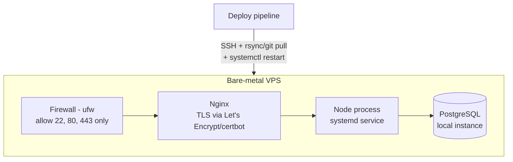

# Purrification — Architecture Plan

Derived from `docs/requirements.md`. This describes *how* the system will be
built to satisfy those requirements — components, data flow, and deployment
topology. Requirement IDs (e.g. `R-AUTH-1`) are referenced throughout for
traceability.

## System overview

```mermaid
flowchart LR
    Browser -->|HTTPS| Nginx[Nginx reverse proxy + TLS]
    Nginx --> App[Next.js app\n(App Router, Node process)]
    App --> DB[(PostgreSQL)]
    App --> Session[Session store\n(DB-backed or signed cookie)]
```

A single Next.js application serves the landing page, the authenticated app
(cat management, quiz, results), and its own API routes — one deployable unit,
one codebase, matching the brief's "single codebase for learning" goal.

## Application layers

| Layer | Responsibility | Satisfies |
|---|---|---|
| **Pages/UI** (`app/`) | Landing page, auth forms, cat dashboard, quiz flow, result cards, public share page, history view | R-LAND-1, R-CAT-4, R-QUIZ-1/2, R-DIAG-3/4, R-HIST-2 |
| **API routes** (`app/api/*`) | `POST /signup`, `POST /login`, `POST /logout`, `POST /cats`, `GET /cats`, `PATCH /cats/:id`, `DELETE /cats/:id` (cascades to that cat's history — see R-CAT-5), `POST /cats/:id/quiz` (creates `QuizAttempt` + `Diagnosis` atomically), `GET /cats/:id/history` | R-AUTH-1/2/3, R-CAT-1/2/3/4/5, R-QUIZ-3, R-HIST-1, R-DIAG-5 |
| **Public routes** (`app/share/[shareSlug]`, unauthenticated) | Read-only diagnosis view by `shareSlug`, not `id` | R-DIAG-3/4 |
| **Domain services** (`lib/`) | Password hashing/verification, session issuance, DB-backed diagnosis-engine derivation | R-AUTH-1/2, R-DIAG-1/2/5 |
| **Data access** (Prisma/Drizzle client) | Typed queries, migrations | R-DATA-1, R-DATA-2 |
| **Content data** (PostgreSQL, seeded via `npm run db:seed-content` from versioned `prisma/seed/content/` files — see below) | Quiz questions/topics/tags, diagnosis/treatment/ritual definitions | R-CONTENT-1..6, out-of-scope "no admin CMS" |

### Diagnosis engine (R-DIAG-1/2/5, R-CONTENT-1..6)
`getDiagnosis(catName: string, answers: QuizAnswer[]) -> { diagnosisDefId,
treatmentId, ritualId, tagTotalsSnapshot, severityLabel, diagnosisText,
ritualText }`, DB-backed as of Phase 13 (`src/lib/diagnosis/getDiagnosis.ts`)
rather than the pure static-array function this section originally
described. Answers accumulate weighted tags; active `DiagnosisDef` rows are
evaluated in priority order (first full match wins); severity is banded from
the matched rule's own tags; the default `Treatment` and a severity-matched
`Ritual` are selected; templates are slot-filled and frozen into
`diagnosisText`/`ritualText`. Full behavior spec:
`docs/content/content-storage-architecture.md` §9 — not duplicated here.
This keeps R-TONE-1/2 enforceable by content review (of the seeded content,
not runtime moderation). Deliberately, `Cat.traits` is not a parameter here
(per R-CAT-3/R-DIAG-2): traits are display-only this round, not diagnosis
input.

To satisfy R-DIAG-5 (the function must be *total* — it can never fail to
return a result), exactly one active `DiagnosisDef` is authored as a
catch-all (always-true trigger rule, highest priority) — checked both at
content-seed time and as an in-process assertion on first use. This is a
deliberately *weaker* totality guarantee than the pre-Phase-13 hash-bucket
approach it replaced (mathematically total by construction, vs. total by
authored-content-plus-a-validated-invariant now) — see
content-storage-architecture.md §9.3 for the full tradeoff discussion.

### Diagnosis persistence is atomic (R-DIAG-1/5)
`POST /cats/:id/quiz` creates the `QuizAttempt` and its `Diagnosis` together
in one DB transaction (`prisma.$transaction(...)`): insert the
`QuizAttempt`, call `getDiagnosis`, insert the `Diagnosis` — all-or-nothing.
If any step fails, nothing is committed and the client can retry the
submission; a `QuizAttempt` is never left in the database without a
`Diagnosis`. This is also why the Prisma schema below models
`QuizAttempt.diagnosis` as optional (`Diagnosis?`): Prisma's 1:1 relation
puts the foreign key on the `Diagnosis` side, so the type system has no way
to mark the reverse relation "always present." The optional type is a
modeling artifact of that FK placement, not a signal that a
diagnosis-less `QuizAttempt` is a valid, expected state — the transaction
above is what actually guarantees R-DIAG-1.

### Sharing (R-DIAG-3/4)
Every `Diagnosis` gets a `shareSlug` — a separate, unguessable public
identifier (e.g. `cuid()`), never the row's primary key, so a share link
can't be used to enumerate or guess other diagnoses. `GET
/share/[shareSlug]` is an unauthenticated Next.js page/route that looks a
diagnosis up by `shareSlug` and renders only `diagnosisText`, `ritualText`,
and the cat's `name` — it must not join in or expose `userId`, `email`, the
cat's other quiz history, or any other account data. This is deliberately
just a public URL: no OAuth share flow, no platform API call, no
share-count tracking — those remain out of scope per `requirements.md`.

## Data model (R-DATA-1/2)

Concrete schema sketch (Prisma-style), one-to-one with `requirements.md`'s
entity list. This sketch stays scoped to the four models below; the
Question/Tag/DiagnosisDef/Treatment/Ritual content model (R-CONTENT-1..6)
that the amended `Diagnosis` model's FKs point into is specified in full in
`docs/content/content-storage-architecture.md` §7, not duplicated here.

```prisma
model User {
  id           String   @id @default(cuid())
  email        String   @unique
  passwordHash String
  cats         Cat[]
  createdAt    DateTime @default(now())
}

model Cat {
  id            String         @id @default(cuid())
  userId        String
  user          User           @relation(fields: [userId], references: [id])
  name          String
  // Display-only flavor (profile/dashboard) — not read by getDiagnosis.
  // See "Diagnosis engine" above.
  traits        Json?
  quizAttempts  QuizAttempt[]
  createdAt     DateTime       @default(now())
}

model QuizAttempt {
  id         String      @id @default(cuid())
  catId      String
  // onDelete: Cascade satisfies R-CAT-5 — deleting a Cat deletes its
  // QuizAttempt history (and, transitively, each attempt's Diagnosis
  // below), since that history has no meaning without the cat.
  cat        Cat         @relation(fields: [catId], references: [id], onDelete: Cascade)
  answers    Json
  // Optional only because Prisma requires the FK on the Diagnosis side of
  // a 1:1 relation — the app-level transaction (see "Diagnosis persistence
  // is atomic" above) guarantees this is never actually null. Do not read
  // this `?` as "a QuizAttempt without a Diagnosis is expected."
  diagnosis  Diagnosis?
  createdAt  DateTime    @default(now())
}

model Diagnosis {
  id            String       @id @default(cuid())
  quizAttemptId String       @unique
  // onDelete: Cascade — deleting the QuizAttempt (e.g. via a cascaded Cat
  // delete, R-CAT-5) deletes its Diagnosis, including the public share
  // link it exposed (R-DIAG-4).
  quizAttempt   QuizAttempt  @relation(fields: [quizAttemptId], references: [id], onDelete: Cascade)
  // Added by the R-CONTENT-* content-storage work (Phase 13). FKs reference
  // the DB-backed content definitions by stable id (R-CONTENT-5) instead of
  // matching rendered text; diagnosisText/ritualText stay as the frozen
  // rendered output (R-CONTENT-6) — see content-storage-architecture.md §7.
  diagnosisDefId    String
  diagnosisDef      DiagnosisDef @relation(fields: [diagnosisDefId], references: [id], onDelete: Restrict)
  treatmentId       String
  treatment         Treatment    @relation(fields: [treatmentId], references: [id], onDelete: Restrict)
  ritualId          String
  ritual            Ritual       @relation(fields: [ritualId], references: [id], onDelete: Restrict)
  tagTotalsSnapshot Json
  severityLabel     String
  diagnosisText String
  ritualText    String
  shareSlug     String       @unique @default(cuid())
  createdAt     DateTime     @default(now())
}
```

Migrations run via the chosen tool's CLI (`prisma migrate` or `drizzle-kit`)
as part of the deploy pipeline (R-INFRA-3) — never manual schema edits in
production.

## Auth (R-AUTH-1/2/3/4)

- Passwords hashed with a modern KDF (bcrypt or argon2) — never stored plain.
- Session-based auth: on login, issue an HTTP-only, `Secure`, `SameSite=Lax`
  session cookie. Session lookup can start as a signed cookie (stateless) and
  move to a DB-backed session table if revocation is needed later — either
  satisfies R-AUTH-3 without pulling in a third-party auth provider.
- No password-reset flow this round (R-AUTH-4) — there's no transactional
  email service in the tech stack to send a reset link through, and adding
  one is out of scope for this round (see `requirements.md` Out of scope).
  A locked-out user is recovered manually by an operator with server access,
  per `vps-runbook.md`'s account-recovery step, not through the app itself.

## Deployment architecture (R-INFRA-1/2/3)

Single bare-metal VPS, since a managed platform is explicitly out per the
brief's hosting decision:



- **OS/hardening (R-INFRA-2):** non-root deploy user, SSH key-only auth
  (disable password login), `ufw` allowing only 22/80/443, automatic security
  updates. This is an ops runbook to execute once, not application code —
  tracked as a separate task/checklist rather than duplicated here.
- **TLS (R-INFRA-2):** certbot-managed Let's Encrypt certificate, Nginx
  terminates TLS and reverse-proxies to the Node process on localhost.
- **Process management:** Node app runs as a `systemd` service (auto-restart
  on crash/reboot) rather than a bare `node` process.
- **Database:** PostgreSQL runs locally on the same VPS for this round
  (single-server simplicity); revisit if/when scale requires splitting it out.
- **Deploy pipeline (R-INFRA-3):** a simple script/CI job that pulls the
  latest build, runs migrations, and restarts the systemd service. No
  orchestration platform needed at this scale.

## Security considerations
- All traffic forced to HTTPS (Nginx redirects 80→443).
- Firewall default-deny, explicit allowlist only.
- Secrets (DB credentials, session secret) via environment variables/.env on
  the server, never committed to the repo.
- **Rate-limit auth endpoints (R-INFRA-4):** enforced at the Nginx layer
  (`limit_req`), not the app layer — it needs no app code, so it can be
  provisioned during VPS setup (`vps-runbook.md` step 9) and is in place
  *before* the app is ever exposed publicly, rather than added in a
  post-launch hardening pass. See `vps-runbook.md` for the concrete config.

## Content storage (R-CONTENT-1..6)
Shipped in `docs/workplan.md` Phase 13: a full Question/Tag/DiagnosisDef/
Treatment/Ritual content model per `docs/content/content-framework.md`'s
pipeline, stored in PostgreSQL and seeded from versioned repo files
(`prisma/seed/content/*.json`, applied via `npm run db:seed-content` —
never an admin CMS) rather than compiled into the app bundle. Still rule-
based/deterministic (R-DIAG-2) — see "Diagnosis engine" above and
`docs/content/content-storage-architecture.md` for the full schema/engine
spec this implements. Phase 13 shipped only placeholder content (today's 5
questions and 10 diagnoses migrated into the new shape, minimal tag
scaffolding); authoring a real, rich content bank is the separately-gated
`docs/workplan.md` Phase 14.

## Open questions / carried from requirements.md
- Final choice between Prisma and Drizzle — either satisfies R-DATA-2; default
  to Prisma unless there's a learning-goal reason to prefer Drizzle.
- Whether sessions are stateless-signed-cookie or DB-backed — start stateless,
  revisit if logout-everywhere/revocation becomes a requirement.
- VPS provider/specs and the detailed hardening checklist (exact `ufw` rules,
  fail2ban, unattended-upgrades config) are an ops task, not covered here.
