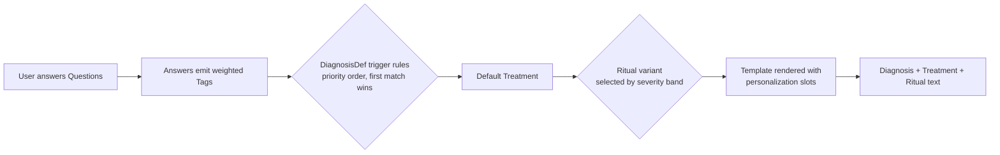

# Purrification — Content Storage Architecture

Derived from `docs/content/content-framework.md` (the content *shape and
rules* spec) and `docs/architecture.md` (this project's system architecture).
This document describes *how* content-framework.md's Question/Tag/Diagnosis/
Treatment/Ritual pipeline will be stored and served from PostgreSQL instead
of the static `src/content/*.ts` files it lives in today. Requirement IDs
(`R-CONTENT-*`, defined in `docs/requirements.md`) are referenced throughout
for traceability, the same convention `architecture.md` uses.

**Scope note:** this document specifies storage, seeding, and engine
*behavior*. It does not contain the actual content bank (real tags,
questions, diagnoses) — that is a separate, later, content-authoring pass
(see `docs/workplan.md` Phase 14). It also does not itself change any code —
see Phase 13 for the implementation checklist this document feeds.

## 1. Why a new document, not an amendment to architecture.md

`architecture.md`'s Data model section sketches a flat 4-model schema
(`User`, `Cat`, `QuizAttempt`, `Diagnosis`) alongside auth, deployment, and
security concerns in one tightly-scoped document. The content model adds
nine new tables and a full derivation-engine redesign — enough to bury that
document's existing structure. This doc is a sibling to
`docs/content/content-framework.md` instead (the same directory, the same
"how do we manage this content" concern), and `architecture.md` gets only a
light cross-reference (see §7).

## 2. Pipeline recap



This is `content-framework.md` §1's pipeline, unchanged — this document only
adds *where each stage's data lives* and *how it's evaluated at request
time*.

## 3. Naming: `DiagnosisDef`, not `Diagnosis`

The framework's "Diagnosis" class (a content definition: name, trigger rule,
severity bands, linked treatments) is **not** the same thing as this
project's existing `Diagnosis` Prisma model (the per-quiz-attempt *result*
row already referenced throughout `results/[id]`, `share/[shareSlug]`,
`getDiagnosisImage`, and `requirements.md`'s data model section). Renaming
the existing model would ripple through all of those for no benefit, so the
content-definition class is named **`DiagnosisDef`** instead — short,
greppable, and reads naturally in relations (`DiagnosisDef.linkedTreatments`,
the amended `Diagnosis.diagnosisDefId`). No other content class collides
with an existing name.

## 4. Relational vs. `Json`: the rule, applied consistently

This project already stores two kinds of semi-structured data differently
based on one test: **relational when a field references *other rows* by id;
`Json` when it's a nested expression or small fixed list read wholesale and
never filtered via SQL.** (`Cat.traits` and `QuizAttempt.answers` are both
`Json` today, for exactly this reason — they're read back whole, never
queried.) The new content model applies the same test:

- **`AnswerOption.tag_effects` → a relational join table**
  (`AnswerOptionTagEffect`), not `Json`. It references `Tag` rows by id, and
  normalizing it buys real FK integrity: a typo'd tag id becomes a seed-time
  constraint failure instead of a silently dead branch that never
  accumulates — exactly the authoring bug `content-framework.md` warns
  about (every answer option must carry ≥1 real tag effect).
- **`DiagnosisDef.triggerRule`, `DiagnosisDef.severityBands`,
  `Ritual.selectionConditions` → `Json`.** These are nested boolean-
  expression trees or short fixed lists, authored rarely, always read whole
  and interpreted once per diagnosis generation. Normalizing `triggerRule`
  into a recursive rule-tree schema (nodes/operators/children) would be
  disproportionate complexity for content that's validated programmatically
  at seed time instead (walking the `Json`, confirming every referenced tag
  id exists in `Tag`).
- **List-of-string fields** (`materialCategories`, `contraindications`,
  `symptomCallbackPool`, `materials`, `stepsTemplate`,
  `personalizationSlots`) → native Postgres `String[]`, not `Json` — Prisma
  supports ordered string arrays directly, so there's no reason to wrap them.

## 5. Stable content ids, not `cuid()`

Content rows (`Tag`, `QuestionTopic`, `Question`, `AnswerOption`,
`Treatment`, `DiagnosisDef`, `Ritual`) use **human-authored stable string
ids as literal primary keys** — e.g. `q_007`, `diag_boundary_erosion`,
`treat_boundary_restoration`, `ritual_boundary_restoration_std`,
`territorial_anxiety` — matching `content-framework.md`'s own worked
examples exactly. These rows are only ever created at seed time (never
concurrently at request time, where `cuid()`'s collision-avoidance actually
matters), and stable ids keep seed files git-diffable and cross-referenceable
in prose. Runtime rows (`User`, `Cat`, `QuizAttempt`, `Diagnosis`) are
unaffected and keep `cuid()` — that convention doesn't change.

**Every content class's stable id must be unique within that class — the
seed script upserts by id, so a reused id silently overwrites rather than
erroring.** For most classes this is naturally satisfied (an author would
never reuse `diag_boundary_erosion` for two different diagnoses), but
`AnswerOption` is the one case where authors naturally want short,
question-local ids (`a1`, `a2`, ...) — a real content pass did exactly this,
reusing the same handful of ids across all 20 questions, and the seed
script's upsert-by-id silently reassigned each id's row to whichever
question was processed last, leaving every earlier question with zero
answers (see `board/content-id-integrity-fix.md`'s incident writeup, Phase
16). The fix is structural, not a naming convention to remember: the seed
script derives `AnswerOption.id` as `` `${questionId}::${localId}` ``, so
authors keep writing question-local ids in `questions.json` and global
uniqueness is guaranteed by construction rather than by discipline.
`prisma/seed/index.ts`'s `validate()` additionally asserts id-uniqueness for
every content class (including per-question local-id uniqueness and a final
check on the derived global id) as defense-in-depth, but that validator is
a safety net — it is not what makes `AnswerOption` ids actually unique.

## 6. Content rows are retired, never deleted

`Question`, `DiagnosisDef`, `Treatment`, and `Ritual` all get
`isActive Boolean @default(true)`. The seed script (§8) is upsert-only and
never issues a `DELETE`. Every FK from the runtime `Diagnosis` model to a
content table uses `onDelete: Restrict`, so even an accidental manual content
deletion is blocked at the database level rather than orphaning or silently
mutating historical results.

## 7. Schema

Target shape for a future `prisma/schema.prisma` addition (Phase 13
implements this; nothing below is applied by this document itself):

```prisma
enum QuestionInputType {
  SINGLE_SELECT
  MULTI_SELECT
  SCALE
}

// R-CONTENT-1: canonical tag vocabulary, defined up front (see §10).
model Tag {
  id          String                  @id
  description String?
  createdAt   DateTime                @default(now())
  effects     AnswerOptionTagEffect[]
}

model QuestionTopic {
  id        String     @id
  name      String
  sortOrder Int
  questions Question[]
  createdAt DateTime   @default(now())
}

// R-CONTENT-1: content stored in Postgres, not compiled into the bundle.
model Question {
  id             String            @id
  topicId        String
  topic          QuestionTopic     @relation(fields: [topicId], references: [id])
  promptMystical String
  promptPlain    String
  inputType      QuestionInputType
  sortOrder      Int
  isActive       Boolean           @default(true)
  answers        AnswerOption[]
  createdAt      DateTime          @default(now())
}

model AnswerOption {
  id            String                  @id
  questionId    String
  question      Question                @relation(fields: [questionId], references: [id], onDelete: Cascade)
  labelMystical String
  labelPlain    String
  sortOrder     Int
  tagEffects    AnswerOptionTagEffect[]
  createdAt     DateTime                @default(now())
}

// Relational tag_effects map, not Json — see §4.
model AnswerOptionTagEffect {
  answerOptionId String
  answerOption   AnswerOption @relation(fields: [answerOptionId], references: [id], onDelete: Cascade)
  tagId          String
  tag            Tag          @relation(fields: [tagId], references: [id])
  weight         Int
  @@id([answerOptionId, tagId])
}

model Treatment {
  id                 String                  @id
  nameMystical       String
  namePlain          String
  philosophy         String
  materialCategories String[]
  typicalDuration    String
  contraindications  String[]                // must always be non-empty — validated at seed time
  isActive           Boolean                 @default(true)
  ritualVariants     Ritual[]
  diagnosisLinks     DiagnosisDefTreatment[]
  results            Diagnosis[]
  createdAt          DateTime                @default(now())
}

// R-CONTENT-3/4: the rule-based derivation engine's content definitions.
model DiagnosisDef {
  id                  String                  @id
  nameMystical        String
  namePlain           String
  triggerRule         Json                    // { all_of, any_of, none_of } over tag totals
  priority            Int                     // evaluation order, most-specific first
  severityBands       Json                    // [{ min, max, label }]
  descriptionTemplate String
  descriptionSlots    String[]                // every {slot} used in descriptionTemplate; validated like Ritual.personalizationSlots
  symptomCallbackPool String[]
  isCatchAll          Boolean                 @default(false) // exactly one active row — totality guarantee
  imagePath           String?                 // R-CONTENT-5: replaces getDiagnosisImage's text-equality lookup
  isActive            Boolean                 @default(true)
  linkedTreatments    DiagnosisDefTreatment[]
  results             Diagnosis[]
  createdAt           DateTime                @default(now())
}

// Ordered linked_treatments — sortOrder 0 is the default.
model DiagnosisDefTreatment {
  diagnosisDefId String
  diagnosisDef   DiagnosisDef @relation(fields: [diagnosisDefId], references: [id])
  treatmentId    String
  treatment      Treatment    @relation(fields: [treatmentId], references: [id])
  sortOrder      Int
  @@id([diagnosisDefId, treatmentId])
  @@unique([diagnosisDefId, sortOrder])
}

model Ritual {
  id                   String    @id
  parentTreatmentId    String
  parentTreatment      Treatment @relation(fields: [parentTreatmentId], references: [id])
  selectionConditions  Json      // { severity_band: [...] } — only severity is evaluated this round, see §9
  priority             Int       // sibling-variant priority order
  titleTemplate        String
  materials            String[]
  stepsTemplate        String[] // >= 3 steps — validated at seed time
  incantationTemplate  String?  // nullable — resolves content-framework.md's open question structurally, see §10
  aftercareNote        String
  personalizationSlots String[] // renderer validates every entry has real data before returning
  isActive             Boolean  @default(true)
  results              Diagnosis[]
  createdAt            DateTime @default(now())
}

// AMENDED — existing runtime per-attempt result, name unchanged.
model Diagnosis {
  id                String       @id @default(cuid())
  quizAttemptId     String       @unique
  quizAttempt       QuizAttempt  @relation(fields: [quizAttemptId], references: [id], onDelete: Cascade)
  // R-CONTENT-5: reference content by stable id, not by matching rendered text.
  diagnosisDefId    String
  diagnosisDef      DiagnosisDef @relation(fields: [diagnosisDefId], references: [id], onDelete: Restrict)
  treatmentId       String
  treatment         Treatment    @relation(fields: [treatmentId], references: [id], onDelete: Restrict)
  ritualId          String
  ritual            Ritual       @relation(fields: [ritualId], references: [id], onDelete: Restrict)
  tagTotalsSnapshot Json         // frozen audit snapshot of the tag totals that produced this result
  severityLabel     String       // frozen at generation time
  // R-CONTENT-6: frozen rendered output — never re-rendered from a later-edited DiagnosisDef/Ritual.
  diagnosisText     String
  ritualText        String
  shareSlug         String       @unique @default(cuid())
  createdAt         DateTime     @default(now())
}
```

`QuizAttempt.answers` stays `Json`, unchanged in shape — its
`{questionId, optionId}` pairs now reference stable DB-backed `Question`/
`AnswerOption` ids by convention, validated at submit time the same way
today's code validates against the static `quizQuestions` array (against
DB-loaded active rows instead). A fully relational `QuizAnswer` join table
was considered — real FK integrity on submitted answers — but rejected for
this round: it's a bigger breaking change to a model with real production
rows in it already, and the design smell this document actually needs to
fix is on the `Diagnosis` side (§9's `getDiagnosisImage` text-equality join),
not here.

**`SCALE` input type**: modeled as 5 ordinary `AnswerOption` rows (labels
`"1"`..`"5"`), each with its own `tagEffects` — no schema special-casing.
`inputType` only changes UI rendering and answer-completeness validation
(`SINGLE_SELECT`: exactly one chosen; `MULTI_SELECT`: at least one, sum all;
`SCALE`: exactly one of the five pre-authored rows).

## 8. Seed / authoring workflow

**Deliberate, explicit decision: the storage engine changes (files → DB
tables); the authoring workflow does not.** Content is still edited by
committing versioned files to the repo, not through an admin CMS
(`R-CONTENT-2`, carrying forward the product brief's decision) — the seed
script is the only thing that changes how those committed files reach the
running app.

- **Location:** `prisma/seed/content/` — one JSON file per class:
  `tags.json`, `topics.json`, `questions.json` (each question embeds its
  `answers[]` inline, mirroring `content-framework.md`'s own JSON shape),
  `treatments.json`, `diagnoses.json`, `rituals.json`.
- **Format: JSON, not TypeScript.** Matches `content-framework.md`'s worked
  examples 1:1 for whoever (or whatever authoring agent) writes content next
  — no translation step — and keeps content strictly declarative, with no
  risk of logic creeping into a content file the way an executable `.ts`
  module invites.
- **Entry point:** `prisma/seed/index.ts`. Validates each file before
  writing anything: every tag reference resolves against `Tag` **and every
  `AnswerOption`'s `tag_effects` is non-empty (≥1 entry)** — this is the
  specific authoring bug §4 cites as the reason `tag_effects` is a relational
  join table in the first place: FK validation alone only catches a *typo'd*
  tag id, not an answer option seeded with *no* tag effects at all, which is
  a silent dead branch in the diagnosis logic. Any offending `question_id`/
  `answer_id` pair aborts the run before any upsert, listed in the error, the
  same fail-loudly stance as every other check here. The validator also
  confirms exactly one active `isCatchAll` `DiagnosisDef` exists, **that
  priorities among active `DiagnosisDef` rows are unique, and that the
  `isCatchAll` row's `priority` is strictly the highest among them** — a
  priority tie makes match order depend on unspecified DB row order
  (nondeterministic), and a non-catch-all row seeded with a priority above
  the catch-all's is permanently unreachable dead content, so either
  violation aborts the run the same way — every
  `personalizationSlots` entry appears literally in its own templates and
  vice versa (the same check applies to `DiagnosisDef.descriptionSlots`
  against `descriptionTemplate`, for the identical reason), `contraindications`
  is non-empty, **`stepsTemplate` has ≥3 entries** (not merely non-empty —
  this is `content-framework.md`'s "every ritual needs at least 3 concrete,
  sequential steps" rule, the single biggest quality risk the framework
  calls out, so the validator enforces the actual threshold rather than
  just presence), `severityBands` are non-overlapping and gapless, and sibling
  `Ritual.selectionConditions` under one `Treatment` are either mutually
  exclusive or explicitly priority-ordered. Then it **upserts by stable id**
  in dependency order:
  tags → topics → questions + answers + tag effects → treatments →
  diagnosis defs + treatment links → rituals. It never deletes a *top-level*
  content row; a stable id present in the DB but absent from the current
  seed files is reported as stale (a candidate for hand-editing to
  `isActive: false`), never auto-removed — preserving FK integrity for
  historical `Diagnosis` rows that may still reference it.
- **Join/child rows are synced, not just upserted.** `AnswerOptionTagEffect`
  (an answer's `tag_effects` map) has no identity of its own outside its
  parent answer's current JSON — unlike top-level content, there's no
  `isActive` flag to retire an individual tag effect, and no historical FK
  ever points at one directly. So after upserting the tag effects present
  in the current pass, the seed script also deletes any existing
  `AnswerOptionTagEffect` row for that answer whose tag is *no longer*
  present in its `tag_effects` — otherwise a future edit that removes a tag
  from an answer would leave the old row behind, silently still
  contributing to tag totals forever (confirmed as a real, distinct latent
  bug during the Phase 16 investigation, on top of the id-collision one
  above). Any future child collection with the same "no independent
  identity, expressed as an array in the parent's JSON" shape (e.g. Phase
  15's planned `DiagnosisDefImage` pool) should follow the same
  delete-then-recreate-per-parent pattern, not a bare upsert loop.
- **New script:** `npm run db:seed-content`, named to match the existing
  `db:migrate`/`db:generate` convention. Kept separate from
  `prisma migrate deploy` (schema DDL, not data) and from `postinstall`'s
  `prisma generate` (seeding content is a deliberate authoring act, not an
  automatic side effect of `npm install`). Runs every deploy, immediately
  after `prisma migrate deploy` — safe to run repeatedly since it's
  idempotent. This adds one step to `vps-runbook.md` step 12 / `CLAUDE.md`'s
  documented deploy sequence.

## 9. Diagnosis-derivation engine (behavior spec — no code in this document)

1. **Tag accumulation:** for each submitted answer, sum its
   `AnswerOptionTagEffect` weights into a running `{tagId: number}` total.
2. **Trigger-rule evaluation:** load active `DiagnosisDef` rows ordered by
   `priority` ascending (most-specific first, per `content-framework.md`'s
   guidance); evaluate each `triggerRule` (`all_of` = AND, `any_of` = OR-at-
   least-one, `none_of` = AND-none) against the tag totals. **First full
   match wins**, evaluation stops there.
3. **Totality guarantee (`R-CONTENT-4`, extends `R-DIAG-5`):** exactly one
   active `DiagnosisDef` is authored with `isCatchAll: true`, an
   always-true `triggerRule`, and the highest `priority` number (evaluated
   last), and no two active `DiagnosisDef` rows share a `priority` value.
   This full invariant — existence, uniqueness, and ordering together, not
   just existence — is checked twice: authoritatively by the seed-time
   validator (§8), and as defense-in-depth by an in-process assertion at
   first use, the same role today's `diagnosisPool.length === 0` startup
   check plays. **This is a deliberate, weaker guarantee than today's
   mechanism**: the current hash-bucket approach is total *by mathematical
   construction* (`hash % pool.length` always produces an index); the new
   engine is total *by authored-content plus a validated invariant*. The
   two checks above mitigate this but don't make it structurally
   impossible to violate the way the hash-bucket did.
4. **Severity banding:** sum the tag totals referenced by the *matched*
   diagnosis's own `triggerRule` (not the grand total across every tag in
   the quiz — this matches `content-framework.md`'s worked example
   precisely), then find the containing `severityBands` entry.
5. **Treatment selection:** always the default
   (`DiagnosisDefTreatment.sortOrder = 0`) this round. Severity-driven
   alternate-treatment selection is deferred — `content-framework.md`
   doesn't specify *when* an alternate should be chosen instead, and
   inventing that rule now would be an undocumented product decision, not
   a storage decision.
6. **Ritual-variant selection:** filter the chosen `Treatment`'s `Ritual`
   rows by `selectionConditions.severity_band` matching the resolved
   severity; pick the lowest `priority` among matches. **Only
   `severity_band` is evaluated this round** — `household_size`/cat-trait
   conditions from `content-framework.md`'s worked example require
   `Cat.traits` to become diagnosis input, which `R-CAT-3`/`R-DIAG-2`
   explicitly forbid. Both Phase 13's placeholder content and Phase 14's
   real content must stay within data the app actually collects.
7. **Template rendering:** fill `{cat_name}` (from `Cat.name`) and any other
   slot the intake flow can actually supply — for both `Ritual` templates
   (validated against `personalizationSlots`) and `DiagnosisDef.descriptionTemplate`
   (validated against `descriptionSlots`, §7); throw rather than leak a
   literal `{slot}` into rendered text in either case. Phase 13's placeholder
   content restricts itself to `cat_name` only, since no UI exists yet to
   collect a room or object name. **`symptomCallbackPool` selection is
   simplified this round**: pick 1–2 entries at random from the matched
   `DiagnosisDef`'s pool (slot-filling each the same way as
   `descriptionTemplate`), rather than `content-framework.md`'s suggested
   "lines whose source question the user actually triggered high-weight
   tags on." That heuristic requires a callback line to reference the
   specific `Tag`(s) that justify picking it, which isn't part of this
   schema — adding it would mean turning `symptomCallbackPool` from a flat
   `String[]` into a relational structure (e.g. `{text, tagIds}` rows), a
   real modeling decision Phase 14's content-authoring pass should make
   once real content shows whether the extra precision is worth the
   complexity. Random selection is a safe placeholder in the meantime: it
   still produces valid, on-theme flavor text, just without the
   answer-citing precision `content-framework.md` describes as aspirational
   for this field.
8. **Persistence:** unchanged shape — one `prisma.$transaction` still
   creates `QuizAttempt` then `Diagnosis` (now carrying the new
   `diagnosisDefId`/`treatmentId`/`ritualId` FKs, `tagTotalsSnapshot`, and
   `severityLabel`, alongside the still-frozen `diagnosisText`/
   `ritualText`). `R-DIAG-2` (rule-based, no LLM) and `R-DIAG-5` (atomic,
   total) both continue to hold.
9. **Performance:** `getDiagnosis` becomes DB-backed and async. The active
   content graph (tags, questions, diagnosis defs with rules, treatments,
   rituals) is cached as a module-level singleton, loaded once per process
   lifetime rather than re-queried per submission — content only changes
   via redeploy + reseed + `systemctl restart`, which already happens on
   every deploy.

**`getDiagnosisImage` fix (`R-CONTENT-5`):** the current text-equality
lookup (matching a stored `diagnosisText` string back against the static
pool) is replaced entirely by a direct FK join —
`diagnosis.diagnosisDef.imagePath`.

## 10. Resolutions to content-framework.md §7's open questions

1. **Canonical tag vocabulary, defined up front, as its own table: yes.**
   This is the load-bearing mechanism that makes seed-time validation
   possible at all — without a `Tag` table to check references against, a
   typo'd tag id in an `AnswerOption` would silently never accumulate,
   exactly the failure mode `content-framework.md` itself warns about.
2. **Diagnosis count target: 10**, for Phase 14's initial real content pass
   — matches today's existing `diagnosisPool` size exactly and sits
   comfortably inside `content-framework.md`'s suggested 8–15 range.
3. **Single diagnosis per result, first-full-match-wins — confirmed.**
   Matches current app behavior exactly (one `Diagnosis` row, one card, one
   share page) and avoids a real product/requirements change that a
   primary-plus-secondary reading would force onto `R-DIAG-1/3/4`,
   `DiagnosisCard`'s layout, and the share page's "diagnosis + ritual + cat
   name only" rule.
4. **Incantations resolved structurally, not editorially:**
   `Ritual.incantationTemplate` is nullable on every row (§7). *Whether* a
   given ritual gets one is an authoring-time call for Phase 14, not
   something Phase 13's schema needs to gate.

## 11. Cross-references

`docs/architecture.md`'s Data model section and Application-layers table
get light updates reflecting this document (see its "Content data" row and
Prisma block) rather than duplicating this document's detail.
`docs/requirements.md` gains the `R-CONTENT-*` requirement category this
document's `R-CONTENT-N` citations refer to. `docs/workplan.md` Phase 13
implements everything in §7–§9 above as placeholder-content plumbing; Phase
14 (separately gated) is the real content-authoring pass this document
defers throughout §9–§10.
